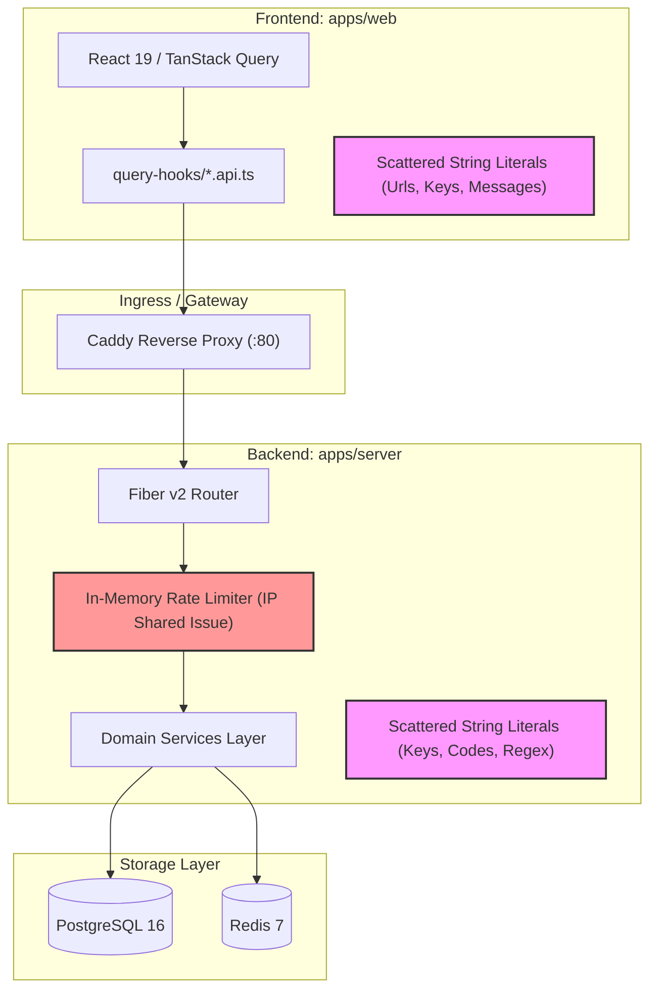

# Comprehensive Application & Codebase Audit Report

> [!IMPORTANT]
> **Audit Context & Scope:**
> As instructed, this audit excludes missing authentication, authorization, and multi-tenant teams mechanics (which are scheduled for subsequent architectural phases). The report focuses strictly on **security vulnerabilities**, **logic breaking bugs**, **logic mismatches**, **network overloading & DB round-trips**, **resource exploitation**, **software issues**, **code writing practices**, and an exhaustive inventory of **hardcoded strings** across both [`apps/server`](file:///home/rahulcodepython/Workspace/IdentityCard/apps/server) (Go) and [`apps/web`](file:///home/rahulcodepython/Workspace/IdentityCard/apps/web) (Next.js/React).

---

## 1. Executive Summary & Architectural Health

The application features a modern stack combining **Go 1.26 + Fiber v2** on the backend and **Next.js 16 (App Router) + React 19 + TanStack Query v5 + Tailwind CSS v4** on the frontend. The project exhibits strong architectural foundations: PostgreSQL CTE queries are used heavily to minimize round-trips in several modules, WebAuthn platform passkeys are integrated for scanner hardware, and TanStack Table powers data presentation.

However, the audit revealed several critical structural bottlenecks, multiple-round-trip database anti-patterns in key mutation APIs, DoS/resource exploitation vectors in filtering and client-side date loops, and severe hardcoded string proliferation across both client and server.



---

## 2. Security Vulnerabilities (Excluding Auth / Authz / Teams)

### 2.1 Reverse Proxy Client IP Spoofing & Global Rate-Limiter Denial of Service
- **Location:** [`apps/server/cmd/server/main.go`](file:///home/rahulcodepython/Workspace/IdentityCard/apps/server/cmd/server/main.go#L57-L64) and [`apps/server/internal/middlewares/rate_limiter.go`](file:///home/rahulcodepython/Workspace/IdentityCard/apps/server/internal/middlewares/rate_limiter.go#L16-L31)
- **Severity:** High
- **Vulnerability:**
  The Fiber server is instantiated with default proxy configuration (`EnableTrustedProxyCheck: false`). At the same time, [`Caddyfile`](file:///home/rahulcodepython/Workspace/IdentityCard/Caddyfile) runs as a reverse proxy in front of `127.0.0.1:8000`.
  Because trusted proxies are not enabled, `c.IP()` returns `127.0.0.1` for *every* client request entering through Caddy.
  Since [`RateLimiterMiddleware`](file:///home/rahulcodepython/Workspace/IdentityCard/apps/server/internal/middlewares/rate_limiter.go#L16-L31) uses `KeyGenerator: func(c *fiber.Ctx) string { return c.IP() }` with a limit of 100 requests/minute, **all concurrent users worldwide share one single 100 req/min bucket**. An attacker (or regular concurrent traffic) making 100 requests will lock out all users from the application.
  Furthermore, the PIN verification rate limiter in [`global.devices.services.go`](file:///home/rahulcodepython/Workspace/IdentityCard/apps/server/internal/features/devices/global.devices.services.go#L66-L109) locks out `clientIP`. Under proxying, five bad PIN guesses from one user locks out *all* users from pairing devices for 15 minutes!

### 2.2 Unvalidated Form Submission Payload (Arbitrary JSON Injection)
- **Location:** [`apps/server/internal/features/register/register.services.go`](file:///home/rahulcodepython/Workspace/IdentityCard/apps/server/internal/features/register/register.services.go#L82-L90)
- **Severity:** Medium-High
- **Vulnerability:**
  In [`SubmitApplicationService`](file:///home/rahulcodepython/Workspace/IdentityCard/apps/server/internal/features/register/register.services.go#L67), the incoming `req.Data` is accepted as an arbitrary `map[string]interface{}` and directly serialized to JSON without any validation against the form's schema (`event_forms.fields`).
  An external user calling `POST /api/v1/public/apply/:eventFormId` can bypass required fields, inject malicious HTML/script payloads into string attributes, supply arbitrarily deeply nested JSON trees, or upload massive strings into the PostgreSQL `jsonb` column up to the 1MB request body limit.

### 2.3 Sequential JSONB Scanning & DoS via Search Query
- **Location:** [`apps/server/internal/features/applicants/applicants.services.go`](file:///home/rahulcodepython/Workspace/IdentityCard/apps/server/internal/features/applicants/applicants.services.go#L51)
- **Severity:** Medium
- **Vulnerability:**
  When searching applicants, the query interpolates:
  `a.data::text ILIKE '%' || $N || '%'`
  Casting a large JSONB document to text and running an unindexed wildcard substring search across all applicant rows bypasses database indexes, consumes high CPU, and can be abused to cause database query latency spikes.

### 2.4 Leaked Development Origins in Production Frontend Configuration
- **Location:** [`apps/web/next.config.ts`](file:///home/rahulcodepython/Workspace/IdentityCard/apps/web/next.config.ts#L5)
- **Severity:** Low-Medium
- **Vulnerability:**
  A specific developer ngrok tunnel `redbird-trusting-macaque.ngrok-free.app` is hardcoded into `allowedDevOrigins`. In production deployments, this domain remains whitelisted if built directly without env gating.

---

## 3. Logic Breaking Bugs

### 3.1 Non-Atomic Client-Driven Bulk Date Update (State Corruption)
- **Location:** [`apps/web/query-hooks/event-dates.api.ts`](file:///home/rahulcodepython/Workspace/IdentityCard/apps/web/query-hooks/event-dates.api.ts#L158-L185)
- **Severity:** High
- **Description:**
  `useBulkUpdateEventDatesMutation` executes **two sequential HTTP requests** across the network:
  1. `DELETE /events/${eventId}/dates/bulk`
  2. `POST /events/${eventId}/dates/bulk`
  If network connectivity drops after step 1 or if step 2 fails due to validation errors, the event's dates are permanently deleted and not restored. Mutations must be unified on the backend into a single atomic transaction or CTE.

### 3.2 Misaligned Route Naming: Typo in `/overwride`
- **Location:**
  - Server: [`apps/server/internal/features/events/dates/dates.routes.go`](file:///home/rahulcodepython/Workspace/IdentityCard/apps/server/internal/features/events/dates/dates.routes.go#L13)
  - Web: [`apps/web/query-hooks/event-dates.api.ts`](file:///home/rahulcodepython/Workspace/IdentityCard/apps/web/query-hooks/event-dates.api.ts#L126)
- **Severity:** Medium
- **Description:**
  Both backend and frontend encode the spelling error `overwride` (`group.Post("/overwride", h.OverwrideHandler)`). If third-party integrations, mobile scanners, or corrected frontend code call `/override`, the API returns a 404 Not Found.

### 3.3 Zombie Orphaned Records on Applicant Deletion
- **Location:** [`apps/server/internal/features/applicants/applicants.queries.go`](file:///home/rahulcodepython/Workspace/IdentityCard/apps/server/internal/features/applicants/applicants.queries.go#L52-L55)
- **Severity:** Medium-High
- **Description:**
  [`DeleteApplicantQuery`](file:///home/rahulcodepython/Workspace/IdentityCard/apps/server/internal/features/applicants/applicants.queries.go#L52-L55) only deletes from `event_applicants`:
  ```sql
  DELETE FROM event_applicants WHERE event_id = $1::uuid AND user_id = $2;
  ```
  Because `event_applicants.user_id` has a foreign key `REFERENCES applicants (id) ON DELETE CASCADE`, deleting from the child table `event_applicants` **leaves the parent row in `applicants` orphaned**. Furthermore, any existing attendance logs in `event_attendance` referencing `applicants (id)` remain intact, creating ghost attendance records for deleted event applicants.

### 3.4 Inconsistent User ID Generation (Form ID vs Event ID)
- **Location:**
  - [`apps/server/internal/features/register/register.services.go`](file:///home/rahulcodepython/Workspace/IdentityCard/apps/server/internal/features/register/register.services.go#L91)
  - [`apps/server/internal/features/applicants/applicants.services.go`](file:///home/rahulcodepython/Workspace/IdentityCard/apps/server/internal/features/applicants/applicants.services.go#L293-L302)
- **Severity:** Medium
- **Description:**
  [`GenerateApplicantUserID`](file:///home/rahulcodepython/Workspace/IdentityCard/apps/server/internal/features/register/register.services.go#L28) docstring states: `Format: {event_uuid_first_8}-{random_uuid_first_8}-{YYYYMMDD}`.
  However, in `register.services.go:91`:
  `userID := GenerateApplicantUserID(eventFormID)` — it passes `eventFormID`!
  In `applicants.services.go:302`, manual registration passes `eventID`.
  Consequently, public applicants receive IDs prefixed by the registration form's UUID, while admin-created applicants receive IDs prefixed by the event UUID.

---

## 4. Logic Mismatches

| Location | Server Reality | Client Expectation / Spec | Impact |
| :--- | :--- | :--- | :--- |
| **Applicant Pagination Limit** | [`applicants.handlers.go`](file:///home/rahulcodepython/Workspace/IdentityCard/apps/server/internal/features/applicants/applicants.handlers.go#L31) defaults to `30`. | [`generic/constants.go`](file:///home/rahulcodepython/Workspace/IdentityCard/apps/server/internal/generic/constants.go#L78) sets `DefaultLimit = 50`. | Inconsistent pagination chunking between endpoints. |
| **Device Actual Name Fallback** | Server fallback in [`global.devices.services.go:222`](file:///home/rahulcodepython/Workspace/IdentityCard/apps/server/internal/features/devices/global.devices.services.go#L222) is `"Web Scanner Device"`. | Web client in [`app/devices/pair/page.tsx:94`](file:///home/rahulcodepython/Workspace/IdentityCard/apps/web/app/devices/pair/page.tsx#L94) passes `"Scanner Terminal"`. | Multiple differing default strings representing the same fallback device identity. |
| **Form System Field Key Enforcement** | In [`global.forms.services.go:143-155`](file:///home/rahulcodepython/Workspace/IdentityCard/apps/server/internal/features/forms/global.forms.services.go#L143-L155), if `field.IsSystem && field.Type == "text"`, it overwrites `field.Key = "name"`. | Client form builder allows custom fields with `type: "text"`. | If a client accidentally sends `is_system: true` on a custom text field, the backend overwrites its key to `"name"`, corrupting the form schema. |
| **Date Timezone Inconsistency** | Server dates are evaluated at `UTC` midnight. | Frontend [`getDaysInRange`](file:///home/rahulcodepython/Workspace/IdentityCard/apps/web/app/dashboard/events/[eventId]/analysis/page.tsx#L24) parses dates using local browser time (`new Date(startStr)`). | Off-by-one calendar day shifts for clients in non-UTC time zones (e.g., IST UTC+5:30). |

---

## 5. Network Call Overloading & Exhaustive API Database Network Call Analysis

The table below audits **all 48 backend endpoints** to verify whether each endpoint executes **strictly one database network round-trip** in its entire lifecycle:

| # | HTTP Method & Route | Handler & Service | DB Calls in Lifecycle | Single DB Call? | Notes & Round-Trip Analysis |
|:---:|:---|:---|:---:|:---:|:---|
| 1 | `GET /health` | Health check | 0 | Yes | Responds in-memory (`generic.MsgStatusOk`). |
| 2 | `GET /docs` | Swagger/OpenAPI | 0 | Yes | Serves embedded HTML / documentation. |
| 3 | `GET /api/v1/events` | `ListHandler` -> `ListService` | 1 | **Yes** | Single CTE query aggregating paginated data & total count. |
| 4 | `POST /api/v1/events` | `CreateHandler` -> `CreateService` | 1 | **Yes** | Single CTE inserting into `events` and `event_metadata`. |
| 5 | `GET /api/v1/events/:id` | `GetHandler` -> `GetService` | 1 | **Yes** | Single `QueryJSON` with subquery for metadata. |
| 6 | `PATCH /api/v1/events/:id` | `UpdateHandler` -> `UpdateService` | 1 | **Yes** | Single CTE verifying `end_date` and updating both tables. |
| 7 | `DELETE /api/v1/events/:id` | `DeleteHandler` -> `DeleteService` | 1 | **Yes** | Single `QueryRow` delete with cascade. |
| 8 | `GET /api/v1/events/:eventId/dates` | `ListHandler` -> `ListByMonthService` | 1 | **Yes** | Single `QueryJSONSlice`. |
| 9 | `POST /api/v1/events/:eventId/dates/bulk` | `BulkSaveHandler` -> `BulkUpsertService`| 1 | **Yes** | Single CTE query (`BulkUpsertEventDatesQuery`). |
| 10 | `POST /api/v1/events/:eventId/dates/overwride` | `OverwrideHandler` -> `OverwrideService` | **3 - 5** | <span style="color:red">**NO (VIOLATION)**</span> | Uses `postgres.WithTx` executing: 1. `ValidateEventDatesQuery`, 2. `DeleteAllEventDatesQuery`, 3. `InsertEventDatesQuery`. Plus transaction `BEGIN`/`COMMIT` network trips. |
| 11 | `DELETE /api/v1/events/:eventId/dates/bulk` | `BulkDeleteHandler` -> `BulkDeleteService` | 1 | **Yes** | Single `DB.Exec` with array unnesting. |
| 12 | `GET /api/v1/forms` | `ListHandler` -> `ListService` | 1 | **Yes** | Single CTE query with total count and pagination. |
| 13 | `POST /api/v1/forms` | `CreateHandler` -> `CreateService` | 1 | **Yes** | Single `QueryJSON` insert. |
| 14 | `GET /api/v1/forms/:id` | `GetHandler` -> `GetService` | 1 | **Yes** | Single `QueryJSON` select. |
| 15 | `PUT /api/v1/forms/:id` | `UpdateHandler` -> `UpdateService` | **2** | <span style="color:red">**NO (VIOLATION)**</span> | Redundant pre-fetch: calls `s.GetService` (call 1) then `s.UpdateRepository` (call 2). |
| 16 | `PATCH /api/v1/forms/:id` | `UpdateHandler` -> `UpdateService` | **2** | <span style="color:red">**NO (VIOLATION)**</span> | Redundant pre-fetch: calls `s.GetService` (call 1) then `s.UpdateRepository` (call 2). |
| 17 | `PUT /api/v1/forms/:id/fields` | `UpdateFieldsHandler` -> `UpdateFieldsService` | **2** | <span style="color:red">**NO (VIOLATION)**</span> | Redundant pre-fetch: calls `s.GetService` (call 1) then `s.UpdateFieldsRepository` (call 2). |
| 18 | `PATCH /api/v1/forms/:id/fields` | `UpdateFieldsHandler` -> `UpdateFieldsService` | **2** | <span style="color:red">**NO (VIOLATION)**</span> | Redundant pre-fetch: calls `s.GetService` (call 1) then `s.UpdateFieldsRepository` (call 2). |
| 19 | `DELETE /api/v1/forms/:id` | `DeleteHandler` -> `DeleteService` | 1 | **Yes** | Single `DB.Exec` delete. |
| 20 | `GET /api/v1/events/:eventId/form` | `GetEventFormHandler` -> `GetEventFormService` | 1 | **Yes** | Single `QueryJSON` select. |
| 21 | `POST /api/v1/events/:eventId/form` | `CreateEventFormHandler` -> `CreateEventFormService` | **3** | <span style="color:red">**NO (VIOLATION)**</span> | Pre-check `GetEventFormRepository` (call 1) + Insert (call 2) + Post-fetch `GetEventFormService` (call 3). |
| 22 | `PATCH /api/v1/events/:eventId/form` | `UpdateEventFormHandler` -> `UpdateEventFormService` | **3** | <span style="color:red">**NO (VIOLATION)**</span> | Pre-check `GetEventFormService` (call 1) + Update (call 2) + Post-fetch `GetEventFormService` (call 3). |
| 23 | `POST /api/v1/events/:eventId/form/lock` | `LockEventFormHandler` -> `LockEventFormService` | **3** | <span style="color:red">**NO (VIOLATION)**</span> | Pre-check `GetEventFormService` (call 1) + Lock update (call 2) + Post-fetch `GetEventFormService` (call 3). |
| 24 | `DELETE /api/v1/events/:eventId/form` | `DeleteEventFormHandler` -> `DeleteEventFormService` | **3** | <span style="color:red">**NO (VIOLATION)**</span> | Pre-check `GetEventFormService` (call 1) + `CountApplicantsRepository` (call 2) + Delete (call 3). |
| 25 | `GET /api/v1/public/apply/:eventFormId` | `GetPublicApplyConfigHandler` | 1 | **Yes** | Single `QueryJSON` with CTE checking capacity and deadlines. |
| 26 | `POST /api/v1/public/apply/:eventFormId` | `SubmitApplicationHandler` | 1 | **Yes** | Single atomic CTE (`SubmitApplicationCTEQuery`). |
| 27 | `GET /api/v1/events/:eventId/applicants/schema`| `GetApplicantSchemaHandler` | 1 | **Yes** | Single `QueryJSON` query. |
| 28 | `GET /api/v1/events/:eventId/applicants` | `ListApplicantsHandler` -> `ListApplicantsService` | **2** | <span style="color:red">**NO (VIOLATION)**</span> | Calls `GetAssignedFormRepository` (call 1) to inspect field types, then `QueryApplicantsWithFiltersRepository` (call 2). |
| 29 | `POST /api/v1/events/:eventId/applicants` | `CreateApplicantHandler` -> `CreateApplicantService` | 1 | **Yes** | Single atomic CTE (`CreateApplicantAtomicQuery`). |
| 30 | `DELETE /api/v1/events/:eventId/applicants/:applicantId` | `DeleteApplicantHandler` | 1 | **Yes** | Single `DB.Exec` delete. |
| 31 | `POST /api/v1/devices` | `CreateDeviceHandler` -> `CreateDeviceService` | 1 | **Yes** | Single `QueryJSON` insert. |
| 32 | `GET /api/v1/devices` | `ListDevicesHandler` -> `ListDevicesService` | 1 | **Yes** | Single `DB.Query` select. |
| 33 | `GET /api/v1/devices/me` | `GetMyDeviceHandler` | 1 (+1 async) | **Yes** | 1 synchronous token select; spawns 1 background goroutine for last active touch. |
| 34 | `POST /api/v1/devices/verify` | `VerifyDeviceHandler` -> `VerifyDeviceService` | **2** | <span style="color:red">**NO (VIOLATION)**</span> | Selects device by PIN (call 1) then updates device row with token (call 2). |
| 35 | `POST /api/v1/devices/webauthn/register-options` | `WebAuthnRegisterOptionsHandler` | 1 | **Yes** | 1 DB query (fetch by PIN) + 1 Redis write. |
| 36 | `POST /api/v1/devices/webauthn/register-verify` | `WebAuthnRegisterVerifyHandler` | **2** | <span style="color:red">**NO (VIOLATION)**</span> | 1 Redis read + Fetch device by ID (call 1) + Update credentials (call 2). |
| 37 | `POST /api/v1/devices/webauthn/login-options` | `WebAuthnLoginOptionsHandler` | 1 | **Yes** | 1 DB query + 1 Redis write. |
| 38 | `POST /api/v1/devices/webauthn/login-verify` | `WebAuthnLoginVerifyHandler` | **2** | <span style="color:red">**NO (VIOLATION)**</span> | 1 Redis read + Fetch device by ID (call 1) + Update sign count (call 2). |
| 39 | `PATCH /api/v1/devices/:id` | `UpdateDeviceHandler` -> `UpdateDeviceService` | 1 | **Yes** | Single `QueryJSON` update. |
| 40 | `POST /api/v1/devices/:id/regenerate-pin` | `RegeneratePINHandler` -> `RegeneratePINService` | 1 | **Yes** | Single `QueryJSON` update. |
| 41 | `DELETE /api/v1/devices/:id` | `DeleteDeviceHandler` -> `DeleteDeviceService` | 1 | **Yes** | Single `DB.Exec` delete. |
| 42 | `GET /api/v1/events/:eventId/devices` | `ListEventDevicesHandler` | 1 | **Yes** | Single `DB.Query` join. |
| 43 | `GET /api/v1/events/:eventId/devices/available` | `ListAvailableGlobalDevicesHandler` | 1 | **Yes** | Single `DB.Query` join. |
| 44 | `POST /api/v1/events/:eventId/devices/assign` | `AssignEventDevicesHandler` | 1 | **Yes** | Batched pipeline via `pgx.Batch` (single network batch trip). |
| 45 | `DELETE /api/v1/events/:eventId/devices/:deviceId` | `UnassignEventDeviceHandler` | 1 | **Yes** | Single `DB.Exec` delete. |
| 46 | `POST /api/v1/events/:eventId/attendance/scan` | `ScanApplicantHandler` -> `ScanApplicantService` | 1 | **Yes** | Single atomic CTE (`ScanApplicantQuery`). |
| 47 | `POST /api/v1/events/:eventId/attendance/entry` | `MarkEntryHandler` -> `MarkEntryService` | 1 | **Yes** | Single atomic CTE (`MarkEntryAtomicQuery`). |
| 48 | `POST /api/v1/events/:eventId/attendance/exit` | `MarkExitHandler` -> `MarkExitService` | 1 | **Yes** | Single atomic CTE (`MarkExitAtomicQuery`). |
| 49 | `GET /api/v1/events/:eventId/analysis/metrics` | `GetAttendanceMetricsHandler` | 1 | **Yes** | Single CTE query (`GetAttendanceMetricsQuery`). |
| 50 | `GET /api/v1/events/:eventId/analysis/attendees`| `ListAttendeeAnalysisHandler` | 1 | **Yes** | Single dynamic CTE (`BuildFilteredAttendeeAnalysisQuery`). |

> [!WARNING]
> **Summary of Violations:**
> **11 out of 48 endpoints** violate the single database round-trip architectural rule, executing between 2 and 5 round-trips due to redundant pre-fetching checks, non-atomic multi-statement transactions, or split query-then-update logic.

---

## 6. Resource Exploitation Vectors

### 6.1 Browser Main-Thread Freeze in Date Generation
- **Location:** [`apps/web/app/dashboard/events/[eventId]/analysis/page.tsx:24-35`](file:///home/rahulcodepython/Workspace/IdentityCard/apps/web/app/dashboard/events/[eventId]/analysis/page.tsx#L24-L35)
- **Mechanism:**
  ```ts
  function getDaysInRange(startStr: string, endStr: string): string[] {
      const dates: string[] = [];
      const cur = new Date(startStr);
      const end = new Date(endStr);
      while (cur <= end) {
          dates.push(cur.toISOString().split("T")[0]);
          cur.setDate(cur.getDate() + 1);
      }
      return dates;
  }
  ```
  If an attacker or user inputs a broad date range (e.g., `1970-01-01` to `2099-12-31`), the synchronous while loop generates 47,000+ strings in memory on the browser main thread, causing complete UI freeze, unresponsive scripts warning, and tab memory crash.

### 6.2 Goroutine & Connection Pool Exhaustion on Device Token Authentication
- **Location:** [`apps/server/internal/features/devices/global.devices.services.go:561-565`](file:///home/rahulcodepython/Workspace/IdentityCard/apps/server/internal/features/devices/global.devices.services.go#L561-L565)
- **Mechanism:**
  Every time a device token is verified (including on every attendance scan or device poll), the code spawns an unmanaged goroutine:
  ```go
  go func() {
      bgCtx, cancel := context.WithTimeout(context.Background(), 3*time.Second)
      defer cancel()
      _ = s.TouchDeviceActiveRepository(bgCtx, device.ID)
  }()
  ```
  Under peak attendance scanning (e.g. 50 scanners scanning attendees simultaneously), hundreds of concurrent goroutines flood the PostgreSQL connection pool with row-lock updates on `devices.last_active_at`, degrading pool throughput for user transactions.

### 6.3 Unbounded Payload Insertion in Bulk Event Dates & Form Fields
- **Location:**
  - Dates: [`apps/server/internal/features/events/dates/dates.services.go:22`](file:///home/rahulcodepython/Workspace/IdentityCard/apps/server/internal/features/events/dates/dates.services.go#L22)
  - Forms: [`apps/server/internal/features/forms/global.forms.services.go:121`](file:///home/rahulcodepython/Workspace/IdentityCard/apps/server/internal/features/forms/global.forms.services.go#L121)
- **Mechanism:**
  Neither endpoint enforces a maximum array length on the submitted slices. A client can send an array of 50,000 date objects or form fields in one payload, forcing JSON serialization spikes and CPU exhaustion in the Go process.

---

## 7. Software Issues & Edge Cases

1. **Silent JSON Unmarshal Failure in Applicant Handler:**
   In [`applicants.handlers.go:38`](file:///home/rahulcodepython/Workspace/IdentityCard/apps/server/internal/features/applicants/applicants.handlers.go#L38):
   `_ = json.Unmarshal([]byte(filtersParam), &filters)`
   The unmarshal error is completely discarded. If malformed filter JSON is passed, the request proceeds silently as if no filters were supplied, returning incorrect datasets to the client.
2. **Deprecated Base64 Decoding API in QR Scanner:**
   In [`apps/web/app/devices/scan/page.tsx:50`](file:///home/rahulcodepython/Workspace/IdentityCard/apps/web/app/devices/scan/page.tsx#L50):
   `decodeURIComponent(escape(atob(scannedText.trim())))`
   `escape()` is an obsolete ECMAScript legacy method deprecated across modern web standards. Modern UTF-8 decoding should use `Uint8Array` with `TextDecoder`.
3. **Dead Code / Unused Artifact:**
   [`apps/web/proxy.ts`](file:///home/rahulcodepython/Workspace/IdentityCard/apps/web/proxy.ts) is an unused stub file returning `NextResponse.next()`, not mounted in Next.js build or config.
4. **Duplicate User ID Generation Code:**
   Lines 293–302 in [`applicants.services.go`](file:///home/rahulcodepython/Workspace/IdentityCard/apps/server/internal/features/applicants/applicants.services.go#L293-L302) duplicate the exact logic of `GenerateApplicantUserID` from [`register.services.go`](file:///home/rahulcodepython/Workspace/IdentityCard/apps/server/internal/features/register/register.services.go#L28) rather than sharing a utility function.

---

## 8. Code Writing & Engineering Standards Audit

### 8.1 Code Standardization & Project Organization
- **Whitespace / Indentation:** The workspace rule requires strict **4 spaces** across all files. While most files adhere, [`rate_limiter.go`](file:///home/rahulcodepython/Workspace/IdentityCard/apps/server/internal/middlewares/rate_limiter.go) contains tab characters.
- **Service Layer Responsibility Creep:**
  [`global.devices.services.go`](file:///home/rahulcodepython/Workspace/IdentityCard/apps/server/internal/features/devices/global.devices.services.go) has grown to 569 lines, mixing WebAuthn cryptographic parsing, Redis rate-limiting, PIN generation, and CRUD database logic in a single file. This should be modularized into purposeful files:
  - `devices.webauthn.go`
  - `devices.pin.go`
  - `devices.ratelimit.go`
- **Icon Library Duplicity:**
  Both `lucide-react` and `@remixicon/react` are installed in `package.json`. In the frontend components, some files use Remix icons while others import Lucide icons. A single icon library standard should be enforced.

### 8.2 Redundant Code & Dead Code
- **Redundant Database Queries (Pre-checks):** As detailed in Section 5, 8 different endpoints execute redundant read queries prior to executing an update/delete query that could easily handle existence verification in a single `WHERE` clause or `RETURNING` statement.
- **Redundant Aliases:** [`apps/web/query-hooks/event-dates.api.ts:146`](file:///home/rahulcodepython/Workspace/IdentityCard/apps/web/query-hooks/event-dates.api.ts#L146) exports `useReplaceAllEventDatesMutation` solely as an alias for `useOverwrideEventDatesMutation`.

### 8.3 Complexity vs. Generic Code Balance
- **Applicant Dynamic Filter Builder:**
  In [`applicants.services.go:119-231`](file:///home/rahulcodepython/Workspace/IdentityCard/apps/server/internal/features/applicants/applicants.services.go#L119-L231), over 120 lines of repetitive `switch` statements handle comparison operators (`eq`, `neq`, `gt`, `gte`, `lt`, `lte`, `contains`, `starts_with`) across different field types. This can be simplified into a table-driven operator map that drastically reduces cyclomatic complexity while preserving strict safety.

---

## 9. Comprehensive Hardcoded Strings Inventory & Consolidation Architecture

The user identified the core architectural requirement to consolidate **all** hardcoded strings into a single centralized `constants.go` on the backend and a single `constants.ts` on the frontend.

Below is the complete inventory of all hardcoded strings currently scattered throughout both applications:

### 9.1 Backend Hardcoded Strings Inventory (`apps/server`)

| Category | Value / String | Current File Locations | Consolidated Constant Name |
|:---|:---|:---|:---|
| **Redis Keys** | `"rate:verify:lockout:%s"` | `global.devices.services.go:66, 102, 116` | `RedisKeyVerifyLockout` |
| | `"rate:verify:window:%s"` | `global.devices.services.go:72` | `RedisKeyVerifyWindow` |
| | `"rate:verify:failures:%s"` | `global.devices.services.go:91, 115` | `RedisKeyVerifyFailures` |
| | `"webauthn:session:%s"` | `global.devices.services.go:303, 322, 460, 479` | `RedisKeyWebAuthnSession` |
| **Date Layouts** | `"2006-01-02"` | `events.services.go:50, 54, 75, 82`<br>`internal/generic/constants.go:68` | `generic.DateFormat` |
| | `"2006-01"` | `dates.services.go:13` | `generic.MonthFormat` |
| | `"20060102"` | `register.services.go:39`<br>`applicants.services.go:301` | `generic.CompactDateFormat` |
| **Field Types** | `"text"`, `"textarea"`, `"number"`, `"email"`, `"phone"`, `"select"`, `"radio"`, `"checkbox"`, `"date"`, `"time"`, `"file"`, `"switch"` | `global.forms.entities.go:21-34`<br>`applicants.services.go:120-215` | `FieldType*` constants |
| **System Field Keys**| `"name"`, `"email"` | `global.forms.services.go:28, 38, 143, 150`<br>`applicants.services.go:63, 81` | `SystemFieldKeyName`, `SystemFieldKeyEmail` |
| **Default System IDs**| `"field_default_name"`, `"field_default_email"` | `global.forms.services.go:27, 37`<br>`event.forms.services.go:35, 36` | `DefaultFieldIDName`, `DefaultFieldIDEmail` |
| **Form Source Types**| `"template"`, `"scratch"` | `event.forms.services.go:108, 120` | `FormSourceTemplate`, `FormSourceScratch` |
| **Form Statuses** | `"waiting"`, `"live"` | `event.forms.entities.go:30, 31`<br>`register.services.go:60` | `FormStatusWaiting`, `FormStatusLive` |
| **Attendee Statuses**| `"attended"`, `"inside"`, `"not_attended"`, `"all"` | `attendance.services.go:216, 218, 220` | `AttendeeStatus*` constants |
| **Device Defaults** | `"Web Scanner Device"`, `"WebAuthn Verified Device"` | `global.devices.services.go:222, 364` | `DefaultDeviceName`, `DefaultWebAuthnDeviceName` |
| **Token Prefixes** | `"dev_"`, `"reg_"`, `"login_"`, `"fp_"` | `global.devices.services.go:44, 220, 293, 451` | `PrefixDeviceToken`, `PrefixRegSession`, etc. |
| **Route Prefixes** | `"/events"`, `"/dates"`, `"/forms"`, `"/public/apply"`, `"/devices"`, `"/attendance"`, `"/analysis"` | All `*.routes.go` files | `Route*` constants |
| **Query Statuses** | `"not_found"`, `"event_ended"`, `"date_out_of_range"`, `"device_unauthorized"`, `"already_entered"`, `"session_ended"`, `"ok"` | All `*.repositories.go` and `*.services.go` files | `StatusQuery*` constants |

### 9.2 Frontend Hardcoded Strings Inventory (`apps/web`)

| Category | Value / String | Current File Locations | Consolidated Constant Name |
|:---|:---|:---|:---|
| **Storage Keys** | `"device_token"` | `react-query/client.ts:27`<br>`app/devices/pair/page.tsx:57, 97`<br>`app/devices/scan/page.tsx:29`<br>`components/sidebar/app-sidebar.tsx:16` | `STORAGE_KEY_DEVICE_TOKEN` |
| **API Endpoints** | `"/events"`, `"/events/${eventId}/dates"`, `"/events/${eventId}/dates/bulk"`, `"/events/${eventId}/dates/overwride"`, `"/forms"`, `"/forms/${id}/fields"`, `"/events/${eventId}/form"`, `"/events/${eventId}/form/lock"`, `"/public/apply/${eventFormId}"`, `"/events/${eventId}/applicants"`, `"/devices"`, `"/devices/me"`, `"/devices/verify"`, `"/events/${eventId}/attendance/scan"`, `"/events/${eventId}/attendance/entry"`, `"/events/${eventId}/attendance/exit"` | All `query-hooks/*.api.ts` files | `API_ENDPOINTS.*` |
| **Navigation URLs**| `"/dashboard"`, `"/dashboard/events"`, `"/dashboard/forms"`, `"/dashboard/devices"`, `"/devices/pair"`, `"/devices/scan"`, `"/apply"` | `components/sidebar/nav-items.ts`<br>All `page.tsx` breadcrumbs and router pushes | `APP_ROUTES.*` |
| **Query Key Names**| `"events"`, `"event-dates"`, `"forms"`, `"event-form"`, `"public-apply"`, `"applicants"`, `"devices"`, `"attendance"`, `"analysis"` | `react-query/query-keys.ts:2-10` | `QUERY_KEY_ROOTS.*` |
| **Field Types** | `"text"`, `"textarea"`, `"number"`, `"email"`, `"phone"`, `"select"`, `"radio"`, `"checkbox"`, `"date"`, `"time"`, `"file"`, `"switch"` | `components/forms/designer/field-type-config.ts:4-16`<br>`schema/forms.types.ts:4` | `FIELD_TYPES.*` |
| **Toast Messages** | `"Event created successfully"`, `"Event dates saved successfully"`, `"Applicant deleted successfully"`, `"Form updated successfully"`, etc. | Across 15+ mutation hooks and dialog components | `TOAST_MESSAGES.*` |
| **Fallback Names** | `"Scanner Terminal"`, `"fp_browser_device"` | `app/devices/pair/page.tsx:93, 94` | `FALLBACK_DEVICE_NAME`, `FALLBACK_FINGERPRINT` |

---

## 10. Blueprint for Unified Central Constants

### 10.1 Go Central Constants (`apps/server/internal/generic/constants.go`)
```go
package generic

// Route Group Prefixes
const (
    APIV1Prefix       = "/api/v1"
    RouteEvents       = "/events"
    RouteDates        = "/dates"
    RouteForms        = "/forms"
    RoutePublicApply  = "/public/apply"
    RouteApplicants   = "/applicants"
    RouteDevices      = "/devices"
    RouteAttendance   = "/attendance"
    RouteAnalysis     = "/analysis"
)

// Redis Key Patterns
const (
    RedisKeyVerifyLockout   = "rate:verify:lockout:%s"
    RedisKeyVerifyWindow    = "rate:verify:window:%s"
    RedisKeyVerifyFailures  = "rate:verify:failures:%s"
    RedisKeyWebAuthnSession = "webauthn:session:%s"
)

// System & Field Constants
const (
    SystemFieldKeyName      = "name"
    SystemFieldKeyEmail     = "email"
    DefaultFieldIDName      = "field_default_name"
    DefaultFieldIDEmail     = "field_default_email"
    DefaultFormName         = "Event Registration Form"
    DefaultDeviceName       = "Web Scanner Device"
)

// Status Codes in SQL Queries
const (
    StatusOk                = "ok"
    StatusNotFound          = "not_found"
    StatusEventEnded        = "event_ended"
    StatusDateOutOfRange    = "date_out_of_range"
    StatusDeviceUnauthorized= "device_unauthorized"
    StatusApplicantNotReg   = "applicant_not_registered"
    StatusSessionEnded      = "session_ended"
    StatusAlreadyEntered    = "already_entered"
    StatusNotEnteredYet     = "not_entered_yet"
    StatusAlreadyExited     = "already_exited"
)
```

### 10.2 TypeScript Central Constants (`apps/web/lib/constants.ts`)
```ts
// LocalStorage & Session Keys
export const STORAGE_KEYS = {
    DEVICE_TOKEN: "device_token",
} as const;

// Internal Application Route Paths
export const APP_ROUTES = {
    DASHBOARD: "/dashboard",
    EVENTS: "/dashboard/events",
    FORMS: "/dashboard/forms",
    DEVICES: "/dashboard/devices",
    PAIR: "/devices/pair",
    SCAN: "/devices/scan",
    APPLY: (formId: string) => `/apply/${formId}`,
} as const;

// Backend API Endpoints (relative to base API prefix)
export const API_ENDPOINTS = {
    EVENTS: "/events",
    EVENT_BY_ID: (id: string) => `/events/${id}`,
    EVENT_DATES: (eventId: string) => `/events/${eventId}/dates`,
    EVENT_DATES_BULK: (eventId: string) => `/events/${eventId}/dates/bulk`,
    EVENT_DATES_OVERRIDE: (eventId: string) => `/events/${eventId}/dates/override`,
    FORMS: "/forms",
    FORM_FIELDS: (id: string) => `/forms/${id}/fields`,
    EVENT_FORM: (eventId: string) => `/events/${eventId}/form`,
    EVENT_FORM_LOCK: (eventId: string) => `/events/${eventId}/form/lock`,
    PUBLIC_APPLY: (formId: string) => `/public/apply/${formId}`,
    APPLICANTS: (eventId: string) => `/events/${eventId}/applicants`,
    DEVICES: "/devices",
    DEVICES_ME: "/devices/me",
    DEVICES_VERIFY: "/devices/verify",
    ATTENDANCE_SCAN: (eventId: string) => `/events/${eventId}/attendance/scan`,
    ATTENDANCE_ENTRY: (eventId: string) => `/events/${eventId}/attendance/entry`,
    ATTENDANCE_EXIT: (eventId: string) => `/events/${eventId}/attendance/exit`,
    ANALYSIS_METRICS: (eventId: string) => `/events/${eventId}/analysis/metrics`,
    ANALYSIS_ATTENDEES: (eventId: string) => `/events/${eventId}/analysis/attendees`,
} as const;

// Standard Toast User Notifications
export const TOAST_MESSAGES = {
    EVENT_SAVED: "Event saved successfully",
    DATES_SAVED: "Event dates saved successfully",
    APPLICANT_DELETED: "Applicant deleted successfully",
    FORM_LOCKED: "Form locked successfully",
    DEVICE_VERIFIED: "Device paired successfully",
} as const;
```

---

## 11. Actionable Recommendations & Scope of Improvements

### Phase 1: High-Priority Fixes (Critical Stability & Security)
1. **Configure Trusted Proxies in Fiber:**
   Set `EnableTrustedProxyCheck: true` and `TrustedProxies: []string{"127.0.0.1"}` in [`cmd/server/main.go`](file:///home/rahulcodepython/Workspace/IdentityCard/apps/server/cmd/server/main.go) so Caddy-forwarded client IPs are accurately parsed, resolving the global rate-limiter lockout bug.
2. **Correct Route Spelling Typo:**
   Standardize `/dates/overwride` to `/dates/override` across both server routes and web query hooks.
3. **Consolidate Multi-Trip DB Endpoints:**
   Refactor the 11 multi-trip endpoints (especially `UpdateService`, `UpdateFieldsService`, `CreateEventFormService`, and `VerifyDeviceService`) to execute within single SQL CTE statements with `RETURNING`, achieving the required **1 DB round-trip per request** benchmark.
4. **Fix Cascading Applicant Deletion:**
   Update [`DeleteApplicantQuery`](file:///home/rahulcodepython/Workspace/IdentityCard/apps/server/internal/features/applicants/applicants.queries.go#L52) to remove the record from both `applicants` and `event_applicants` inside an atomic CTE.

### Phase 2: Code Quality & Hardcoded Strings Consolidation
1. **Centralize All Strings:**
   Adopt the single [`constants.go`](file:///home/rahulcodepython/Workspace/IdentityCard/apps/server/internal/generic/constants.go) and [`constants.ts`](file:///home/rahulcodepython/Workspace/IdentityCard/apps/web/lib/constants.ts) blueprints. Replace all hardcoded route strings, Redis keys, error messages, storage keys, and status flags.
2. **Remove Dead & Duplicated Code:**
   Delete [`apps/web/proxy.ts`](file:///home/rahulcodepython/Workspace/IdentityCard/apps/web/proxy.ts). Replace the duplicated ID generator in [`applicants.services.go`](file:///home/rahulcodepython/Workspace/IdentityCard/apps/server/internal/features/applicants/applicants.services.go) with the shared `GenerateApplicantUserID` helper.
3. **Modularize Heavy Feature Files:**
   Split [`global.devices.services.go`](file:///home/rahulcodepython/Workspace/IdentityCard/apps/server/internal/features/devices/global.devices.services.go) into specialized modules for WebAuthn, PIN handling, and CRUD.

### Phase 3: Resource Protection & Performance
1. **Protect Date Loop in Analysis Page:**
   Replace the while-loop in [`getDaysInRange`](file:///home/rahulcodepython/Workspace/IdentityCard/apps/web/app/dashboard/events/[eventId]/analysis/page.tsx#L24) with a capped range check (e.g. max 365 days) and timezone-safe date-fns arithmetic.
2. **Throttle Device Last-Active Updates:**
   Instead of launching an unthrottled goroutine on every single device request, buffer device active pings in Redis (`SETEX device:active:<id> 60 1`) and update the PostgreSQL database periodically via a scheduled flush.
3. **JSONB Form Submission Validation:**
   Validate `POST /public/apply/:eventFormId` inputs against the form schema stored in `event_forms.fields` before accepting applicant submissions.
